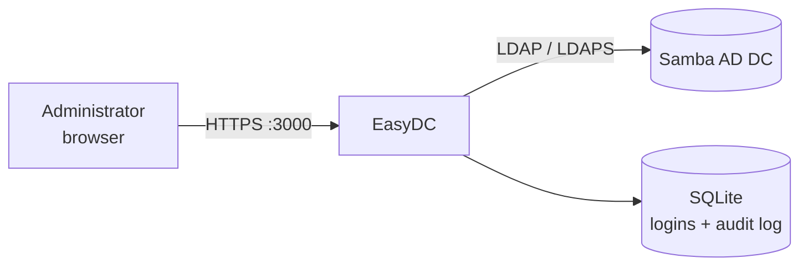

# EasyDC

**Manage a Samba Active Directory Domain Controller from your browser — no CLI required.**

EasyDC is a lightweight, self-contained web application for administering Samba-based Active
Directory Domain Controllers. Instead of logging into the server or wrestling with
`samba-tool`, you manage users, groups, computers, DNS, Group Policy Objects, and
Organizational Units from a clean web interface — with a full audit trail of who changed what.

---

## How it works

EasyDC is a single binary. It connects to one or more Samba DCs over **LDAP/LDAPS**, keeps its
own small SQLite database for logins and audit history, and serves a Bootstrap web UI on port
`3000`. Nothing is installed on the domain controller itself.



- **Web UI** on `http://<host>:3000` — dashboard, users, groups, computers, DNS, GPO, OUs, audit log
- **Multi-server** — administer several domain controllers from one dashboard
- **Self-contained** — templates are embedded in the binary; only the SQLite file is written at runtime

## Feature highlights

- **Users** — create, edit, enable/disable, and delete accounts; **reset passwords** (with
  *force change at next logon*); **unlock** locked-out accounts and see lockout status at a glance
- **Groups** — create security and distribution groups and manage their membership
- **Computers** — view, enable/disable, and remove computer accounts
- **DNS** — browse AD-integrated zones and manage `A`, `AAAA`, `CNAME`, `MX`, `TXT`, `NS`, and
  `PTR` records stored in the domain's DNS partition
- **Group Policy** — create GPOs, set their status flags, and link/unlink them to OUs
- **Organizational Units** — browse the OU tree, create/rename/delete OUs, and move objects between them
- **Audit log** — every change is recorded with the actor, action, target, result, and timestamp
- **First-run setup** — a guided wizard creates the admin account; no config files to edit

## Requirements

| Category | Supported |
|---|---|
| **Directory** | Samba Active Directory Domain Controller, reachable over LDAP/LDAPS |
| **Bind account** | Read/write access to the relevant AD partitions |
| **Platforms** | Linux x86_64 and ARM64 (pre-built binaries provided) |

!!! note
    Password operations (setting `unicodePwd`) require an **LDAPS** connection on port 636.
    Plain LDAP connections will reject password changes.

## Getting started

1. Download the binary for your architecture from the
   [Releases](https://github.com/easysysio/EasyDC/releases) page
   (`easydc-linux-x86_64` or `easydc-linux-arm64`).

2. Make it executable and run it:

    ```bash
    chmod +x easydc-linux-x86_64
    ./easydc-linux-x86_64
    ```

3. Open `http://<host>:3000/setup` and create the admin account (you are redirected here
   automatically on a fresh install).

4. Click **Add Server** and point EasyDC at your DC:

    | Field | Example |
    |---|---|
    | LDAP URL | `ldaps://dc.domain.local` (use LDAPS for password operations) |
    | Bind DN | `CN=Administrator,CN=Users,DC=domain,DC=local` |
    | Bind Password | your password |
    | Skip TLS Verify | enable for self-signed certificates |

## Running as a service

To start EasyDC automatically on boot, install it as a systemd service:

```bash
sudo cp easydc-linux-x86_64 /usr/local/bin/easydc
sudo chmod +x /usr/local/bin/easydc
sudo mkdir -p /var/lib/easydc
```

```ini
# /etc/systemd/system/easydc.service
[Unit]
Description=EasyDC - Samba AD Management GUI
After=network.target

[Service]
Type=simple
WorkingDirectory=/var/lib/easydc
ExecStart=/usr/local/bin/easydc
Restart=on-failure
RestartSec=5

[Install]
WantedBy=multi-user.target
```

```bash
sudo systemctl daemon-reload
sudo systemctl enable --now easydc
```

The interface is then available at `http://<server-ip>:3000`, and the SQLite database lives in
`/var/lib/easydc/easydc.db`.
