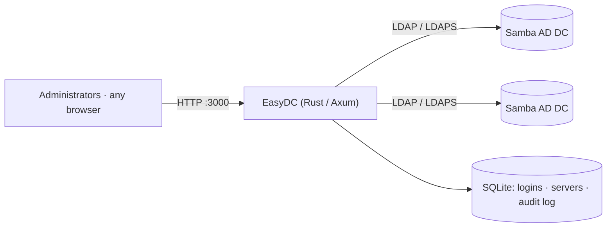

# Reference

## Architecture

EasyDC is a web application and an LDAP client in one binary. Each request opens an LDAP
connection to the chosen domain controller, binds as that server's bind account, and reads
or writes the directory directly. Nothing runs on the domain controllers themselves.

## Requirements

| Category | Supported |
|---|---|
| **Directory** | Samba Active Directory domain controller, reachable over LDAP (389) or LDAPS (636) |
| **Bind account** | Read/write access to the partitions you manage; Domain Admins for full use |
| **EasyDC host** | Linux x86_64 or arm64 — `.deb` and `.rpm` packages, or the bare binary |
| **Browser** | Any current browser |

## Files and ports

| | |
|---|---|
| **Web UI** | HTTP on `0.0.0.0:3000`, or `--port` / `EASYDC_PORT` |
| **Database** | `/var/lib/easydc/easydc.db` when installed from a package; `easydc.db` in the working directory otherwise |
| **Outbound** | LDAP / LDAPS to each domain controller you add |

## Security notes

- **Bind passwords** for the servers you add are stored in the EasyDC database. Restrict
  the file to the service user.
- **Admin passwords** are stored as bcrypt hashes. Sessions use an `HttpOnly`,
  `SameSite=Strict` cookie.
  Changing a password, or removing an administrator, drops that account's other sessions.
- The web UI is **plain HTTP**; publish it through a TLS reverse proxy (see
  [Installation](install.md#put-tls-in-front-of-it)).
- **Password writes** require LDAPS; Samba refuses them over plain LDAP.

## Technology

| Component | Library |
|---|---|
| Web framework | [Axum](https://github.com/tokio-rs/axum) |
| Async runtime | [Tokio](https://tokio.rs/) |
| Database | SQLite via [sqlx](https://github.com/launchbadge/sqlx) |
| Templates | [Tera](https://keats.github.io/tera/), compiled into the binary |
| LDAP client | [ldap3](https://github.com/inejge/ldap3) |
| Password hashing | [bcrypt](https://crates.io/crates/bcrypt) |
| UI | Bootstrap 5 + Bootstrap Icons |
